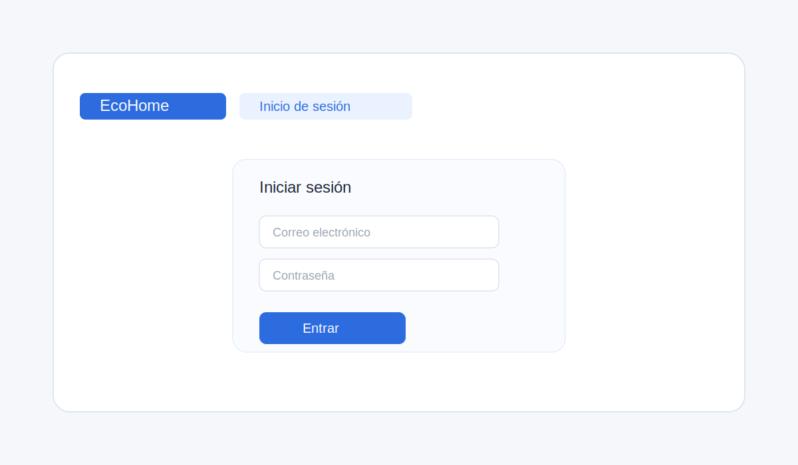
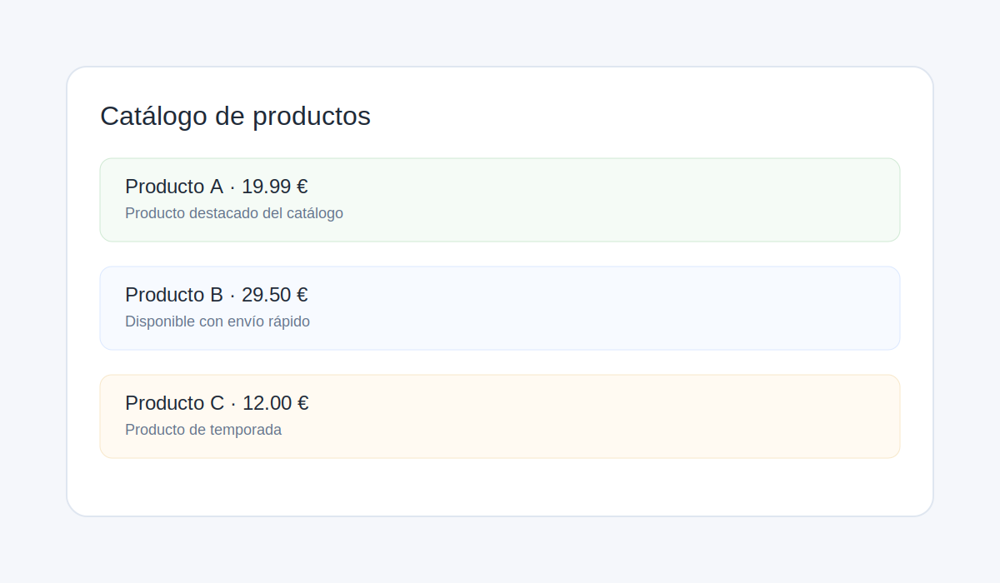
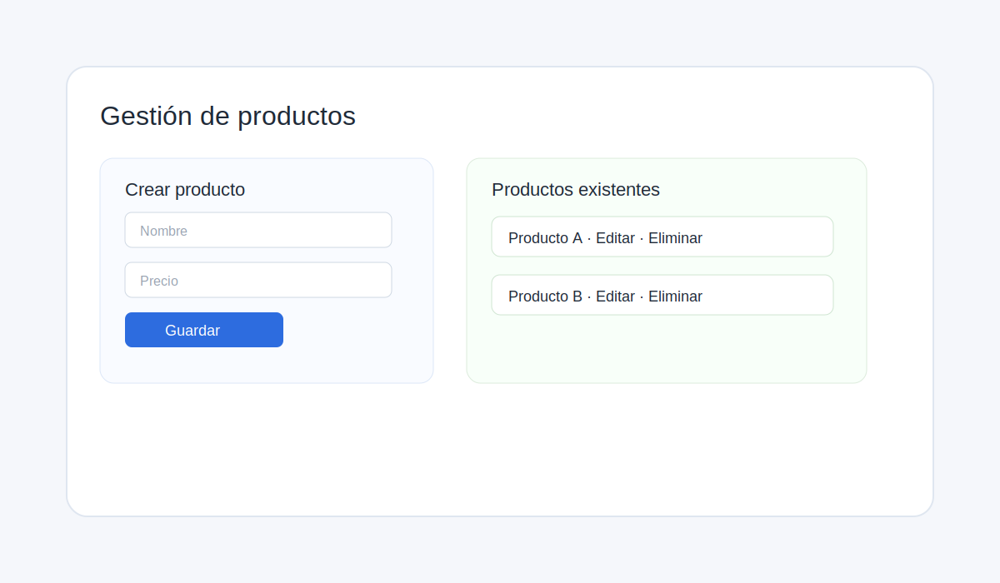
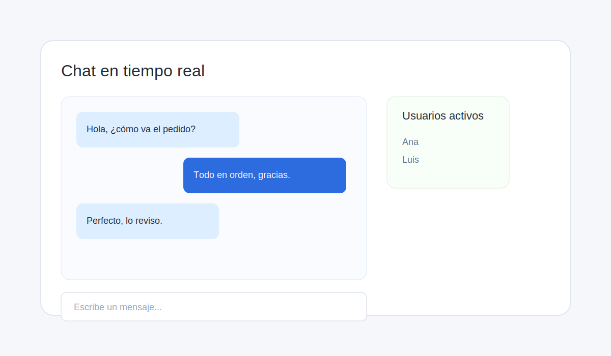

# EcoHome

EcoHome es una aplicación de ejemplo orientada a la gestión de productos y a la comunicación en tiempo real. El proyecto combina un backend en Node.js/Express con PostgreSQL y un frontend en React/Vite para ofrecer una experiencia completa de autenticación, CRUD de productos y chat interno.

## 🚀 Funcionalidades principales

- Registro e inicio de sesión de usuarios con JWT.
- Autorización por roles: usuarios administradores pueden gestionar productos y clientes pueden consultar el catálogo.
- CRUD completo de productos con validaciones básicas.
- Chat en tiempo real mediante Socket.IO.
- Persistencia de mensajes en PostgreSQL.
- API REST preparada para consumo desde web, móvil o escritorio.

## 🛠️ Tecnologías utilizadas

- Backend: Node.js, Express, JWT, bcryptjs, Socket.IO
- Base de datos: PostgreSQL
- Frontend: React, Vite, Socket.IO Client
- Herramientas: npm, nodemon

## 📁 Estructura del proyecto

- src/server.js: punto de entrada del servidor
- src/routes/auth.js: autenticación y registro
- src/routes/products.js: CRUD de productos
- src/routes/messages.js: obtención de mensajes guardados
- src/middleware/auth.js: validación de JWT y control de roles
- frontend/src/App.jsx: interfaz del chat en React
- db/schema.sql: esquema de la base de datos
- docs/: ejemplos de uso y colección de pruebas

## ✅ Requisitos previos

- Node.js 18 o superior
- PostgreSQL instalado y en ejecución
- npm
- Git para subir el proyecto a GitHub

## ⚙️ Configuración del entorno

### 1. Crear el archivo de variables de entorno

En la raíz del proyecto crea un archivo .env a partir del ejemplo:

```bash
copy .env.example .env
```

Contenido esperado:

```env
PORT=3000
DB_HOST=localhost
DB_PORT=5432
DB_NAME=ecohome_db
DB_USER=postgres
DB_PASS=postgres
JWT_SECRET=ecohome-super-secret-change-me
```

Para el frontend, crea también este archivo:

```bash
cd frontend
copy .env.example .env
```

Contenido esperado:

```env
VITE_API_URL=http://localhost:3000
```

## 🗄️ Configuración de la base de datos

1. Asegúrate de que PostgreSQL esté arrancado.
2. Crea la base de datos que usarás, por ejemplo:

```bash
createdb ecohome_db
```

3. Inicializa las tablas del esquema:

```bash
npm run db:init
```

## ▶️ Ejecutar el proyecto localmente

### Backend

```bash
npm install
npm start
```

El backend quedará disponible en:

- http://localhost:3000
- http://localhost:3000/chat

### Frontend

```bash
cd frontend
npm install
npm run dev
```

La interfaz del chat quedará disponible en:

- http://localhost:5173

## 🔐 Autenticación y roles

### Registro

```http
POST /auth/signup
Content-Type: application/json
```

Ejemplo de cuerpo:

```json
{
  "name": "Ana",
  "username": "ana",
  "email": "ana@ecohome.com",
  "password": "123456",
  "role": "client"
}
```

### Login

```http
POST /auth/login
Content-Type: application/json
```

```json
{
  "email": "ana@ecohome.com",
  "password": "123456"
}
```

El login devuelve un JWT que debe enviarse en el header:

```http
Authorization: Bearer <token>
```

## 🧾 Endpoints principales

### Autenticación
- POST /auth/signup
- POST /auth/login

### Productos
- GET /products
- GET /products/:id
- POST /products (solo admin)
- PUT /products/:id (solo admin)
- PATCH /products/:id (solo admin)
- DELETE /products/:id (solo admin)

### Mensajes
- GET /messages

## 🧪 Cómo probar cada funcionalidad

### 1. Registro y login

Prueba el flujo completo de registro e inicio de sesión desde la API o desde el frontend.

### 2. Gestión de productos

Usa el endpoint de productos para crear, actualizar, listar y eliminar productos. Solo los usuarios con rol admin pueden modificar datos.

### 3. Chat en tiempo real

Abre la ruta /chat en el navegador o usa la interfaz React para enviar mensajes en tiempo real.

### 4. Persistencia de mensajes

Los mensajes enviados desde el chat se almacenan en PostgreSQL y pueden consultarse desde /messages.

## 📸 Capturas de referencia

Aqui se han dejado espacio preparado para añadir imagenes reales del proyecto. Puedes reemplazar los archivos placeholder por capturas de pantalla reales cuando las tengas.

### Login y autenticación


### Catálogo de productos


### CRUD de productos (modo admin)


### Chat en tiempo real


## 🧰 Archivos de ejemplo y pruebas

- docs/api-examples.sh: ejemplos de uso con cURL
- docs/EcoHome-API-Collection.json: colección para Postman o Insomnia
- docs/ROADMAP.md: plan de evolución del proyecto
